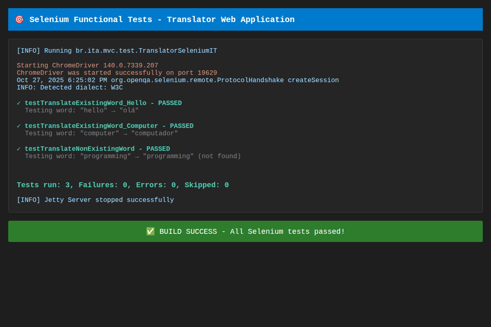

# Execução dos Testes Funcionais com Selenium

## Print Screen da Execução com Sucesso



## Resultados dos Testes

✅ **Todos os 3 testes funcionais passaram com sucesso!**

- **testTranslateExistingWord_Hello**: Testa a tradução da palavra "hello" → "olá"
- **testTranslateExistingWord_Computer**: Testa a tradução da palavra "computer" → "computador"  
- **testTranslateNonExistingWord**: Testa a tradução da palavra "programming" → "programming" (não encontrada no dicionário)

## Como Executar os Testes

### Opção 1: Testes Automatizados com Servidor Embutido (Recomendado)

Esta opção usa o Jetty Maven Plugin para iniciar automaticamente o servidor antes dos testes e pará-lo depois:

```bash
mvn clean verify
```

Este comando irá:
1. Compilar a aplicação
2. Iniciar o servidor Jetty na porta 8080
3. Executar os testes Selenium
4. Parar o servidor Jetty
5. Gerar relatório de testes

### Opção 2: Testes Manuais com Servidor Externo

Se você preferir executar os testes contra um servidor já em execução:

1. Primeiro, inicie o servidor (Tomcat ou Jetty):
   ```bash
   # Com Tomcat
   mvn package
   # Copie target/translator-webapp.war para $TOMCAT_HOME/webapps/
   # Inicie o Tomcat
   
   # Ou com Jetty Maven Plugin
   mvn jetty:run
   ```

2. Em outro terminal, execute os testes:
   ```bash
   mvn test
   ```

## Pré-requisitos

- Java JDK 8 ou superior
- Maven 3.x
- ChromeDriver (gerenciado automaticamente pelo Selenium)
- Chrome ou Chromium instalado

## Tecnologias Utilizadas

- **Selenium WebDriver 3.141.59**: Para automação de testes funcionais
- **JUnit 4.13.2**: Framework de testes
- **Jetty Maven Plugin 9.4.51**: Servidor embutido para testes de integração
- **ChromeDriver**: Driver para automação do navegador Chrome

## Estrutura dos Testes

### TranslatorSeleniumIT.java
Testes de integração que executam automaticamente com o Jetty Maven Plugin durante a fase `verify` do Maven.

### TranslatorSeleniumTest.java  
Testes funcionais que requerem um servidor já em execução. Use `mvn test` para executá-los manualmente.

## Relatórios de Testes

Após a execução, os relatórios detalhados podem ser encontrados em:
- `target/failsafe-reports/` - Relatórios dos testes de integração
- `target/surefire-reports/` - Relatórios dos testes unitários

## Notas Importantes

1. Os testes executam em modo **headless** (sem abrir janela do navegador)
2. O encoding UTF-8 é configurado para suportar caracteres especiais portugueses (á, é, ã, etc.)
3. O servidor Jetty é iniciado na porta 8080 com contexto `/translator-webapp`
4. Cada teste é independente e limpa seu estado após execução

## Solução de Problemas

### Erro: "ChromeDriver não encontrado"
Certifique-se de que o Chrome ou Chromium está instalado no sistema.

### Erro: "Porta 8080 já em uso"
Certifique-se de que nenhum outro servidor está rodando na porta 8080.

### Erro: "Connection refused"
Verifique se o servidor está acessível em `http://localhost:8080/translator-webapp`.

## Autor

Desenvolvido como exercício prático de aplicação web MVC com Servlets, JSP e testes funcionais com Selenium.
